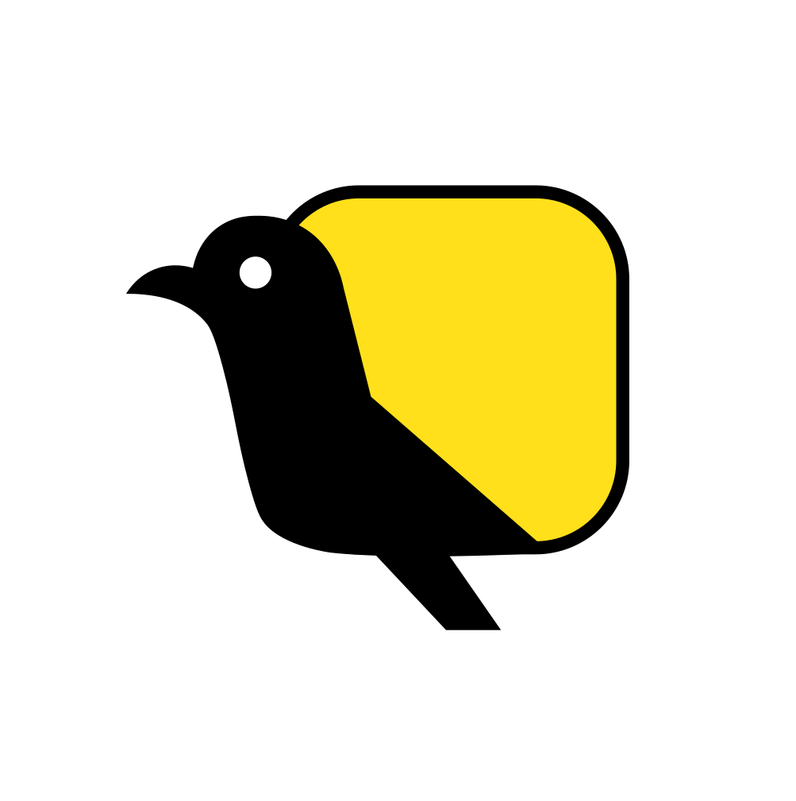

<p align="center">
  
</p>

# memex

**Centralized agentic memory for any LLM or AI agent.**
Your AI agent has amnesia. memex fixes it — and now also acts as an **MCP gateway**, so any tool the agent calls is automatically captured into memory. One MCP connection, two tool families: memex's native memory tools plus every upstream MCP server you connect (filesystem, github, slack, linear, postgres, …). Local-first, MCP-native, ships with curated **skills** the AI can validate against.

[](LICENSE)
[](https://www.python.org/downloads/)

---

## Why memex

Every new session in Claude Code, Cursor, Windsurf, Cline, and others starts cold. Project conventions, decisions, prior failures, and architectural rationale evaporate. `CLAUDE.md` and `.cursorrules` fight back, but they auto-load *every* turn — so they cost tokens whether relevant or not, and they don't sync between tools.

memex is a local daemon with a graph-structured memory the agent retrieves from on demand. The agent calls `recall("auth flow")` and gets back a budget-bounded, confidence-weighted subgraph — only what's relevant, only when needed. It also ships **skills** — installable validation bundles — so the AI must self-attest checks before generating security-, money-, or concurrency-sensitive code.

## What's different

- **Cognitive architecture, not just RAG.** Multi-store (episodic / semantic / procedural), provenance on every node, falsifiable claims, time-decay, working set. Modeled on both RAM hardware (cells, banks, refresh, ECC, cache hierarchy) and human memory (encoding, consolidation, reconsolidation, forgetting curve). See [docs/concepts.md](docs/concepts.md).
- **Skills with validation.** `memex install skill:core-validations` ships globally-applicable engineering principles (secure subprocess, money-decimal precision, structured concurrency, crypto-secrets, SQL parameterization, …) — language-agnostic. `validate("secure-subprocess")` returns the structured `approach + checks` the AI must self-attest before generating code.
- **Watchful, not passive.** Every `add` / `link` / `recall` / `validate` auto-emits an episodic event. `progress()` exposes the full activity log. The AI can introspect what it's already done and avoid repeating itself.
- **Local-first, runs anywhere.** Tier 0 install is ~50 MB, no model downloads, no GPU, BM25 retrieval out of the box. Tier 1 adds embeddings (~80 MB). Tier 2+ optional.
- **MCP + HTTP + CLI.** One daemon, every editor. Claude Code, Cursor, Windsurf, Cline via MCP; everything else via HTTP at `localhost:7777`. Polyglot-friendly: any language can drive memex over HTTP.
- **Self-hosted by default.** No cloud, no telemetry, no API keys. Your memory never leaves your machine.

## Install

```bash
# Recommended (pipx — works on any Python 3.10+ system)
pipx install memex

# Or with uv
uv tool install memex

# Or Docker (no Python required)
docker run -d --name memex \
  -v $HOME/.memex:/data \
  -p 127.0.0.1:7777:7777 \
  quefly/memex:latest
```

## 60-second quickstart

```bash
# 1. Install the bootstrap meta-skill so any AI knows how to use memex
memex install skill:using-memex
memex install skill:core-validations

# 2. Add your first memory
memex add "AuthFI uses Reach for tunneling, not WireGuard" --kind decision

# 3. Recall it
memex recall "how does auth tunnel work?"

# 4. Validate against an approach before generating sensitive code
memex validate secure-subprocess

# 5. See what's been done
memex progress

# 6. Wire it into Claude Code
claude mcp add memex memex serve

# 7. (Optional) Upgrade to vector retrieval
pipx install --force 'memex[embed]'
```

That's it. Claude Code can now `recall`, `validate`, `observe`, and `add` against your persistent graph.

## Editor setup

| Editor | One-line setup |
|---|---|
| Claude Code | `claude mcp add memex memex serve` — see [Claude Code recipe](https://quefly.com/docs/memex/editors/claude-code) |
| Cursor / Windsurf / Cline | Drop the snippet below into the editor's MCP config |
| Any HTTP-capable client | [HTTP recipe](https://quefly.com/docs/memex/editors/http) |
| Docker daemon | [Docker recipe](https://quefly.com/docs/memex/editors/docker) |
| HTTP API reference | [API docs](https://quefly.com/docs/memex/api) |

## MCP gateway (v0.6)

memex doesn't just remember — it can be the *single MCP connection* your AI agent needs. It re-exports tools from upstream MCP servers (the ones you own) alongside its native memory tools, and **auto-captures every call** so memex's perception layer fills without the agent having to remember anything.

```bash
# 1. Browse the curated catalog of popular MCPs
memex upstream catalog

# 2. Install one (drops a templated entry into ~/.memex/upstreams.json)
memex upstream install github
memex upstream install slack
memex upstream install postgres

# 3. Verify a connection
memex upstream test github

# 4. Restart your AI client — the proxied tools now appear alongside
#    memex's native recall/add_node/observe/...
```

Inside the AI agent, two new tools surface:

- `list_upstream_tools()` — discover the catalog of every proxied tool.
- `call_upstream(upstream, tool, arguments)` — dispatch a call. Result is returned to the agent; an episodic event (`kind="tool_call"`) is recorded automatically.

Memex's consolidation pass (v0.7) walks these `tool_call` events and promotes patterns into semantic facts: *"you've sent 14 messages to #engineering — that's your deploy channel"*, *"linear issue creation in ENG-INFRA fails 30% of the time when assignee is unset"*. **Gateway → perception → consolidation → brain.**

### Catalog (curated)

| id | description | requires |
|---|---|---|
| `filesystem` | Read/write files within an allowlist | — |
| `git` | git operations (status, diff, log, commit) | uv |
| `github` | PRs, issues, search, releases | `GITHUB_PERSONAL_ACCESS_TOKEN` |
| `gitlab` | MRs, issues, pipelines | `GITLAB_PERSONAL_ACCESS_TOKEN` |
| `fetch` | HTTP fetch + markdown extraction | uv |
| `puppeteer` / `playwright` | Browser automation | — |
| `sqlite` / `postgres` | Database queries | (postgres URL) |
| `slack` | Send messages, list channels | `SLACK_BOT_TOKEN` + `SLACK_TEAM_ID` |
| `linear` | Issue tracker | `LINEAR_API_KEY` |
| `notion` / `gdrive` | Docs | (api keys / OAuth) |
| `kubernetes` / `aws` | Infra | (kubeconfig / aws creds) |
| `sentry` | Issue details + stack traces | `SENTRY_TOKEN` |
| `time` | Timezone helpers | uv |

`memex upstream catalog` lists everything; `memex upstream show <id>` shows full detail.

### Configuration file

The catalog is just a template — running `memex upstream install <id>` writes a regular entry into `.memex/upstreams.json` (project) or `~/.memex/upstreams.json` (user). Edit by hand if you prefer:

```jsonc
{
  "upstreams": [
    {
      "name": "github",
      "command": "npx",
      "args": ["-y", "@modelcontextprotocol/server-github"],
      "env": {"GITHUB_PERSONAL_ACCESS_TOKEN": "ghp_..."},
      "allow": ["*"],
      "deny":  ["delete_*"],
      "prefix": "{name}__"
    }
  ]
}
```

Project-level config takes precedence over user-level.

## Architecture

```
              ┌─────────────────────────────────────┐
              │         memex core engine            │
              │  (storage + retrieval + lifecycle    │
              │   + working set + ML — protocol-blind)│
              └─────────────────────────────────────┘
                   ▲          ▲          ▲
                   │          │          │
        ┌──────────┴──────┐ ┌─┴────┐ ┌───┴────┐
        │   MCP frontend  │ │ HTTP │ │  CLI   │
        │   (stdio)       │ │ API  │ │        │
        └─────────────────┘ └──────┘ └────────┘
```

- **Graph store**: Kuzu, embedded — provenance + confidence + time-decay built in.
- **Vector store**: sqlite + numpy brute-force at v0.1. HNSW upgrade is a Protocol-conforming swap.
- **Retrieval**: hybrid BM25 + vector + graph traversal, budget-bounded, with reciprocal rank fusion.
- **Working set**: bounded LRU cache (RAM-style L1) — recently-touched concepts get retrieval bias.
- **Frontends**: MCP stdio for AI editors, HTTP for everything else, CLI for shells.
- **Skills**: installable validation bundles. AI calls `validate(skill)` and self-attests checks.

The architecture is built on **SOLID + foundational data structures**: protocol-based interfaces (Repository pattern), constructor dependency injection, strategy pattern for retrieval, provider pattern for embeddings, factory method for default wiring. Every layer has a CS-foundational data structure: property graph (Kuzu), inverted index (BM25), brute-force k-NN, LRU cache, time-indexed btree (sqlite), exponential time decay (Ebbinghaus). Polyglot-friendly: any layer can be reimplemented in any language behind its Protocol.

See [docs/concepts.md](docs/concepts.md) for the full RAM-hardware ↔ human-memory ↔ memex mapping and axiomatic derivation of the architecture.

## Roadmap

| Version | Theme | What's new |
|---|---|---|
| **v0.1** | Foundations | Graph + BM25 + MCP/HTTP/CLI + skills (using-memex, core-validations, python-stdlib) + working set + activity log |
| **v0.2** | Skills registry + repo bootstrap | `queflyhq/memex-skills` external repo + community skills (aws-iam, gcp-essentials, postgres-ops, go-idioms, …); auto-import any repo's `.memex/skills/<name>/` directory or `*.memex.{yml,json,jsonl}` files on first scan — drop knowledge files in your repo and memex picks them up |
| **v0.3** | Passive distillation + intent tracking | Sessions become semantic memory automatically (episodic → semantic consolidation); memex remembers user instructions + AI outcomes + flags when AI deviates from instructed approach |
| **v0.4** | Self-curation | Background consolidation, decay, dedup, contradiction detection |
| **v0.5** | Code-verified confidence | Memory grounded in actual code state — falsifiability checked by background pass |
| **v1.0** | **GA** | All foundations + skills + MCP gateway + curated upstream catalog. PyPI + Docker Hub releases. Per-machine auth token bootstrapping. cosign-signed images. MIT, local-first, zero telemetry. |
| **v1.1** | Consolidation + perception | Episodic→semantic promotion (`memex consolidate`); active pruning of stale nodes; multi-cue retrieval (project / time / file / error); per-tool MCP registration replaces the dispatch meta-tool. |
| **v1.2** | Self-curation | Background consolidation, decay, dedup, contradiction detection. |
| **v1.3** | Code-verified confidence | Memory grounded in actual code state — falsifiability checked by background pass. |
| **v2.0** | Team mode + AuthFI | `memex daemon` deployed on a team server; AuthFI handles SSO + member identity; every node carries `actor=<authfi_user_id>`. Daemon-as-arbiter resolves single-writer DuckDB lock. |

## Team mode (v0.6)

When deployed on a server, memex becomes a team knowledge base. Every concept, decision, and validation is attributed to a user. AI tools can answer:

- *"What is Alice working on?"* — query episodic events filtered by actor
- *"Who decided we'd use Postgres over MySQL?"* — query semantic graph for the decision node, read its `source` and provenance metadata
- *"What approaches has Bob already validated this week?"* — `progress(actor="bob@team.com")`

Auth is handled via [AuthFI](https://authfi.app) — every memex deployment gets an AuthFI tenant for free, so identity, SSO, and member roles are managed without rolling your own. Bring your team's directory or stay invite-only.

## Status

**v1.0 — generally available.** MIT licensed, no telemetry, runs entirely on your machine. APIs are stable under semantic versioning. Use it, file issues, send PRs.

📖 **Full documentation:** [quefly.com/docs/memex](https://quefly.com/docs/memex)
⬇️ **Downloads:** [quefly.com/open-source/memex/download](https://quefly.com/open-source/memex/download)

## License

MIT — see [LICENSE](LICENSE).

## Contributing

See [CONTRIBUTING.md](CONTRIBUTING.md). Issues and PRs welcome. Please follow the [Code of Conduct](CODE_OF_CONDUCT.md). For privacy, see [PRIVACY.md](PRIVACY.md). For security, see [SECURITY.md](SECURITY.md).

---

Made by [Quefly](https://github.com/queflyhq).
